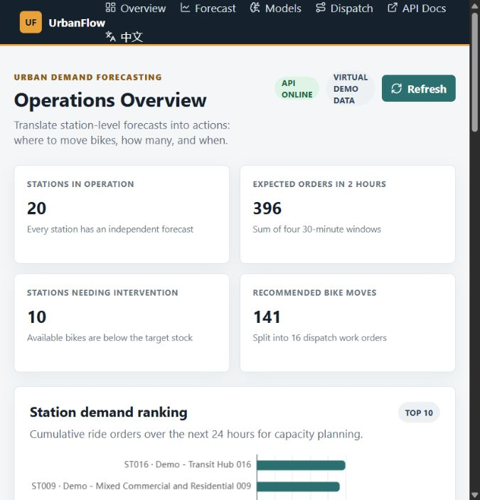
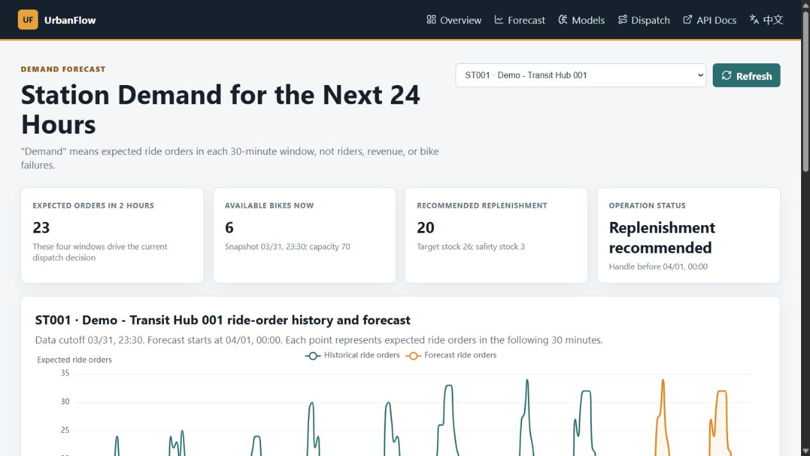
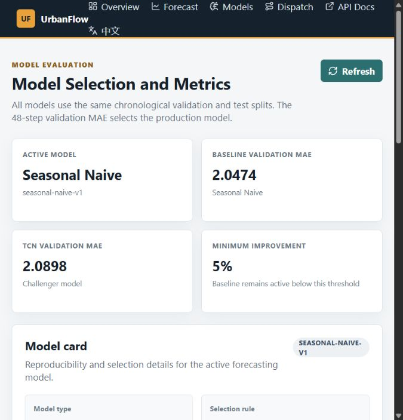
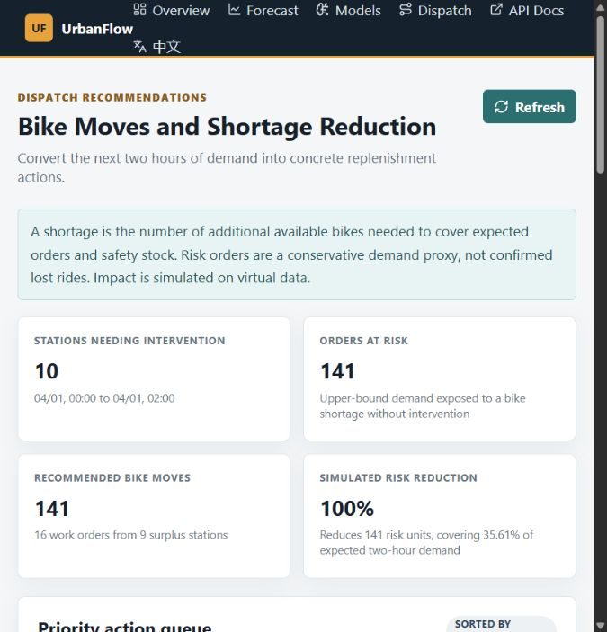
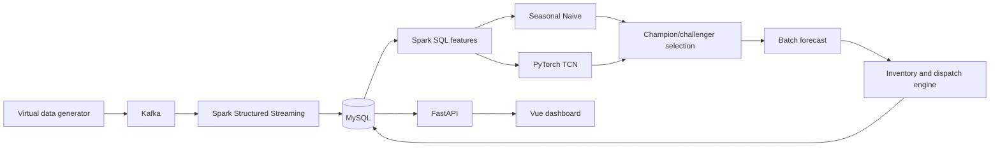

# UrbanFlow

**An AI-assisted urban bike-demand forecasting and dispatch decision-support
platform.**

[中文说明](README.zh-CN.md) | [Documentation](docs/README.md) |
[Verification reports](docs/15-business-value-dispatch-verification.md)

> **中文摘要：** UrbanFlow 是一个 AI 辅助的城市骑行需求预测与调度决策支持
> 平台，使用 Kafka、Spark、PyTorch TCN、FastAPI、Vue 和 MySQL 构建。
> 完整中文说明请查看 [README.zh-CN.md](README.zh-CN.md)。

UrbanFlow is an open-source portfolio project that turns synthetic city
mobility data into a complete machine-learning workflow:

```text
ride events
  -> Kafka
  -> Spark 30-minute windows
  -> MySQL
  -> Spark SQL features
  -> Seasonal Naive baseline + PyTorch TCN challenger
  -> 48-step batch forecast
  -> inventory shortage and dispatch recommendations
  -> FastAPI
  -> Vue operations dashboard
```

The project intentionally separates the **machine-learning pipeline** from the
**currently active production model**. The active model is selected by
validation MAE. A TCN challenger is promoted only when it improves the
Seasonal Naive baseline by at least 5%.

> Current active model: `seasonal-naive-v1`
>
> Current TCN status: trained but not promoted
>
> Current data mode: synthetic demo data

## What makes it an AI project?

UrbanFlow is not a static BI dashboard. It includes:

- Leakage-safe time-series feature engineering.
- Chronological train, validation, and test splits.
- A reproducible Seasonal Naive baseline.
- A PyTorch Temporal Convolutional Network (TCN).
- MAE, RMSE, and sMAPE model evaluation.
- Validation-based champion/challenger model selection.
- Batch inference and model metadata persistence.
- Forecast-to-action generation with inventory and safety stock.
- A model card that exposes the active model, selection rule, and limitations.

The project does not claim that the TCN is always better. In the current
synthetic dataset, the baseline remains better and therefore stays active.

## Business meaning

| Concept | Meaning |
|---|---|
| Demand | Expected ride orders that start in one 30-minute window |
| Available bikes | Bikes that users can rent from the latest inventory snapshot |
| Safety stock | Extra bikes reserved for demand variation |
| Target stock | Expected two-hour orders plus safety stock |
| Shortage | Target stock minus available bikes |
| Dispatch recommendation | A concrete bike transfer with quantity, distance, and deadline |
| Simulated impact | Shortage reduction if all recommendations are executed |

The numbers are intentionally defined in business language so that users can
understand what each value means. Simulated impact is not presented as realized
revenue or real operating benefit.

## Screenshots

### Operations overview



### Station forecast



### Model card and evaluation



### Dispatch recommendations



## Features

### Data and streaming

- Reproducible virtual city data with peaks, weather, holidays, noise, and
  anomalies.
- Kafka event producer.
- Spark Structured Streaming with event-time windows, watermarking,
  checkpoints, and MySQL upserts.
- Spark SQL offline features with lags, rolling statistics, calendar features,
  and chronological splits.

### Forecasting and model governance

- Seasonal Naive baseline.
- PyTorch TCN challenger.
- Paired model comparison on the same test windows.
- Automatic model selection using validation MAE.
- Model card with artifact timestamps, selection reason, and limitations.

### Operations API and dashboard

- FastAPI endpoints for health, stations, demand, forecasts, models, inventory,
  and dispatch.
- MySQL-backed health and data-readiness check.
- Batch consistency check between forecasts and dispatch recommendations.
- Vue 3 and ECharts dashboard.
- English UI by default with a complete Chinese locale switch.

## Architecture



See [the C4 architecture document](docs/02-c4-architecture.md) for diagrams.

## Technology stack

| Layer | Technology |
|---|---|
| Data generation | Python |
| Event streaming | Kafka |
| Distributed processing | Scala, Spark Structured Streaming, Spark SQL |
| Storage | MySQL 8 |
| Machine learning | pandas, NumPy, PyTorch |
| Backend | FastAPI, PyMySQL |
| Frontend | Vue 3, Pinia, Vue Router, ECharts |
| Testing | unittest, Maven, Vite production build |
| Automation | GitHub Actions |

## Repository layout

```text
urbanflow-forecast/
├── code/
│   ├── backend/              # FastAPI service
│   ├── common/               # Shared Scala models and configuration
│   ├── forecast-engine/      # Baseline, TCN, inference, and dispatch
│   ├── frontend/             # Vue dashboard and locale resources
│   ├── offline-analysis/     # Spark SQL feature generation
│   ├── realtime-analysis/    # Spark Structured Streaming
│   ├── scripts/              # Demo pipeline runner
│   ├── simulator/            # Virtual data generator and Kafka producer
│   └── sql/                  # MySQL schema
├── docs/                     # Design and verification documents
├── scripts/                  # Repository checks
└── .github/                  # CI and contribution templates
```

## Quick start

### Prerequisites

- Python 3.11+
- Node.js 20.19+ or 22.12+
- Java 11+
- Maven
- MySQL 8
- Kafka, or the included Docker Compose infrastructure

Docker Compose is optional. The current development machine uses an existing
MySQL installation and a Linux VM running Kafka.

### 1. Start infrastructure

```bash
docker compose -f code/docker/docker-compose.yml up -d
```

The local MySQL port is `3307` when Docker Compose is used. Use the host and
port configured in your `.env`.

### 2. Install Python packages

```bash
python -m pip install -e "code/backend"
python -m pip install -e "code/forecast-engine[deep]"
python -m pip install -e "code/simulator"
```

### 3. Configure the environment

```bash
cp .env.example .env
```

For the included Docker infrastructure, set:

```text
MYSQL_HOST=127.0.0.1
MYSQL_PORT=3307
MYSQL_USER=urbanflow
MYSQL_PASSWORD=urbanflow_dev
MYSQL_DATABASE=urbanflow
APP_LANGUAGE=en
URBANFLOW_LANGUAGE=en
```

### 4. Run the demo pipeline

Preview the full pipeline:

```bash
python code/scripts/run_demo.py --dry-run
```

Run the pipeline:

```bash
python code/scripts/run_demo.py
```

Train the optional TCN challenger:

```bash
python code/scripts/run_demo.py --train-tcn
```

The pipeline can generate data, initialize MySQL, load virtual data, build
Spark features, run the baseline, optionally train the TCN, persist forecasts,
and generate English dispatch recommendations.

### Live demo mode

To make the local dashboard update continuously without starting Kafka or the
Linux VM:

```bash
python code/scripts/live_demo.py \
  --interval-seconds 10 \
  --predict-every 3
```

Live demo mode appends a new 30-minute virtual demand window, updates station
inventory and real-time metrics, and periodically reruns forecast and dispatch
generation. The pages poll for new results automatically.

This mode is a lightweight local demonstration. The Kafka and Spark Structured
Streaming implementation remains available for the full event-driven path.

### 5. Start FastAPI

```bash
python -m uvicorn app.main:app \
  --app-dir code/backend \
  --host 127.0.0.1 \
  --port 8000
```

Swagger UI: `http://127.0.0.1:8000/docs`

Health and data readiness: `http://127.0.0.1:8000/health`

### 6. Start the Vue dashboard

```bash
cd code/frontend
npm install
npm run dev
```

Dashboard: `http://127.0.0.1:5173`

The interface defaults to English. Use the language switch in the navigation
to view the Chinese version.

## Localization

English is the default language for GitHub and the API.

Chinese resources are preserved in:

- `code/frontend/src/locales/zh-CN.js`
- `code/backend/app/locales/zh_CN.py`
- `code/simulator/src/simulator/locales.py`
- `README.zh-CN.md`

Set `APP_LANGUAGE=zh-CN` to make backend-generated text Chinese. Set
`URBANFLOW_LANGUAGE=zh-CN` for generated simulator and dispatch text.

## Tests

```bash
python -m unittest discover -s code/backend/tests -v
python -m unittest discover -s code/forecast-engine/tests -v
python -m unittest discover -s code/simulator/tests -v
mvn -f code/pom.xml test
cd code/frontend && npm run build
python scripts/check_docs.py
```

## Data disclaimer

All included examples use synthetic data. Station names are explicitly marked
as demo names. The `100%` dispatch improvement in the demo means that the
generated work orders cover all **identified synthetic shortages**. It is not a
realized operational benefit.

## Current limitations

- The active production model is a statistical baseline, not the TCN.
- Forecasts are point estimates without prediction intervals.
- Dispatch optimization is a greedy nearest-surplus heuristic.
- Bike returns are not separately predicted.
- Work-order execution is not written back to the system.
- There is no authentication or multi-tenant support.
- The dashboard is a local demo, not a production deployment.

## Contributing

See [CONTRIBUTING.md](CONTRIBUTING.md), [SECURITY.md](SECURITY.md), and the
issue templates under `.github/`.

## License

MIT. See [LICENSE](LICENSE).
