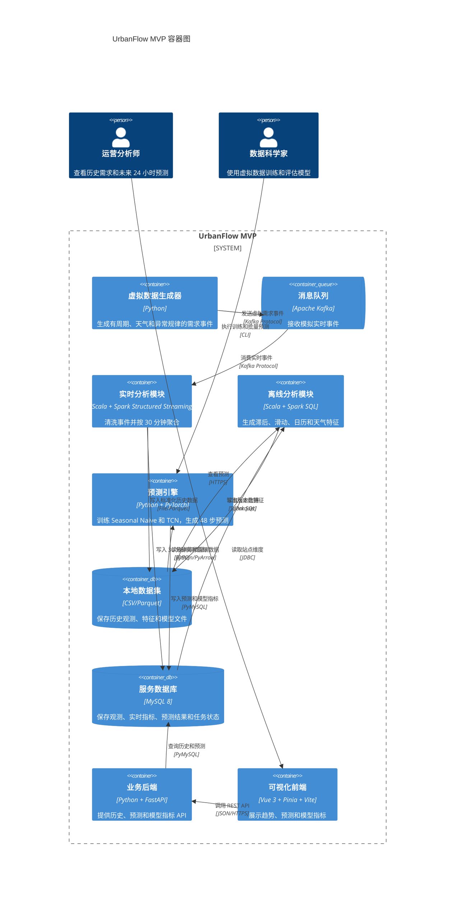
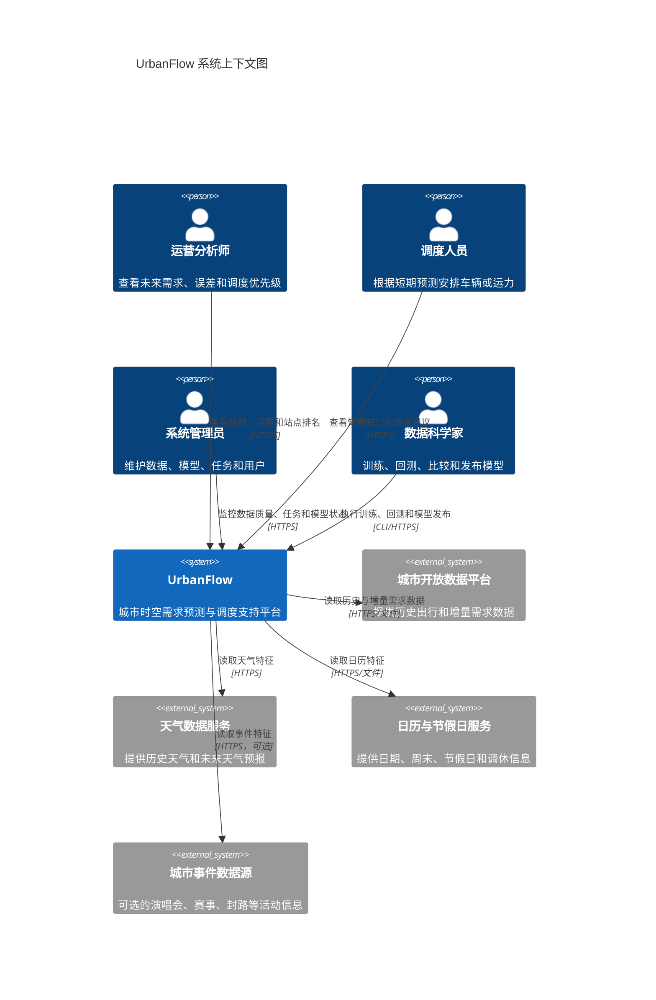
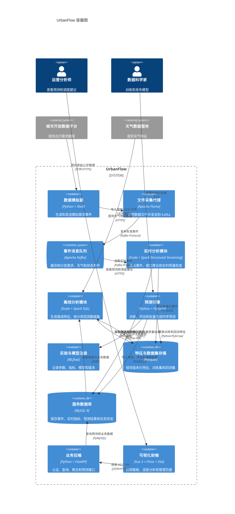
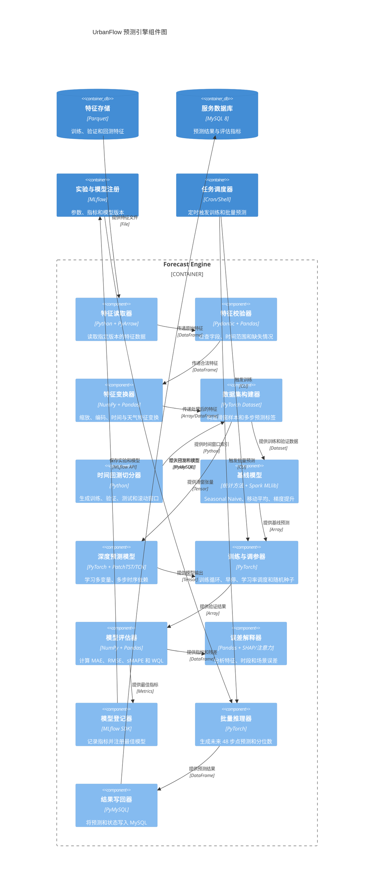
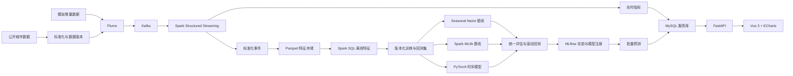
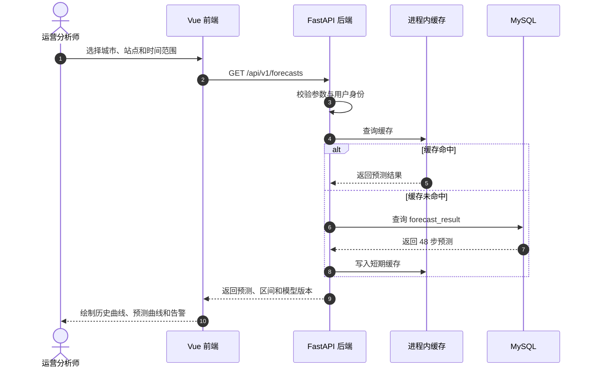
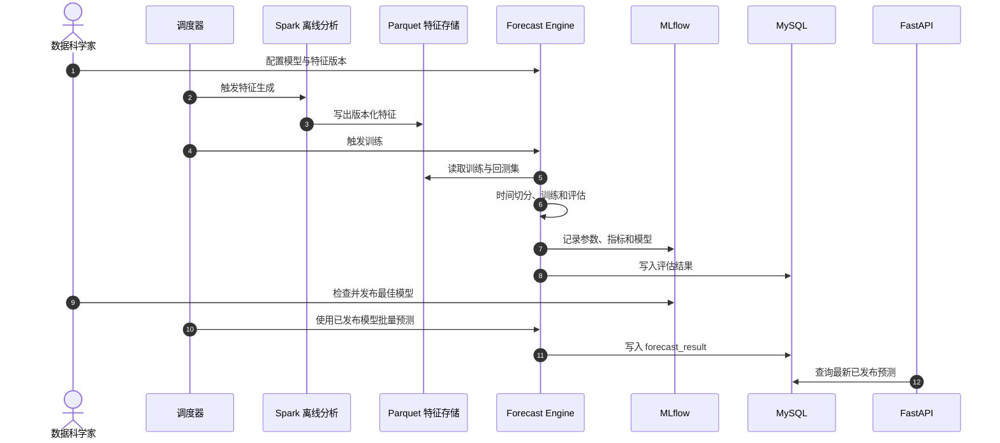

# UrbanFlow C4 架构说明

> **English summary:** This document presents the C4 context, container,
> component, deployment, and data-flow views, together with the target
> architecture and evolution path.
>
> **中文摘要：** 本文展示 C4 系统上下文、容器、组件、部署和数据流视图，
> 并说明目标架构与后续演进路径。

## 1. 文档目的

本文使用 C4 模型描述 UrbanFlow 的系统边界、容器、核心组件和关键数据流。C4 图使用 Mermaid 编写，可直接在支持 Mermaid 的 Markdown 渲染器中查看。

本文同时描述两个层次：

- 当前 MVP：只实现虚拟数据到预测页面的最小闭环。
- 目标架构：后期增加 Flume、MLflow、概率预测、复杂模型和真实数据。

本文包含：

- MVP 容器图。
- 目标系统上下文图。
- 目标容器图。
- 目标预测引擎组件图。
- 目标数据管线流程图。
- 预测查询与模型训练时序图。

## 2. 架构原则

1. MVP 先使用虚拟数据，真实数据通过适配器后期接入。
2. MVP 不引入 Flume、MLflow、Parquet 服务和复杂部署。
3. Kafka、Spark、MySQL、FastAPI 和 Vue 保持原项目技术栈。
4. PyTorch 只负责深度时序模型训练和推理，不替代 Spark。
5. MySQL 保存 MVP 的观测、实时指标、预测和任务状态。
6. 当前先实现点预测，概率区间和复杂模型后期增加。
7. 前端不直接访问数据库，也不包含模型逻辑。

## 3. MVP 容器图

这张图表示当前真正需要实现的最小功能。图中的所有组件都属于 MVP，不包含 Flume、MLflow 和 PatchTST。

## 4. 目标系统上下文图

系统上下文关注“谁使用 UrbanFlow”和“UrbanFlow 依赖哪些外部系统”。

## 5. 目标容器图

这张图表示后期完整目标，不代表 MVP 首批实现范围。

## 6. 目标预测引擎组件图

预测引擎是新增的核心 AI 模块。MVP 只需要其中的读取器、校验器、数据集构建器、切分器、Seasonal Naive、TCN、评估器和推理器。MLflow、PatchTST 和复杂解释器属于后期。

## 7. 目标数据管线流程图

这张图包含完整的后期数据管线。MVP 不经过 Flume，也不使用 MLflow，直接由虚拟数据生成器写入 Kafka。

## 8. 预测查询时序图

## 9. 模型训练与发布时序图

## 10. 部署拓扑

MVP 可以在单机 Docker Compose 中运行：

| 服务 | 端口示例 | 说明 |
|---|---:|---|
| Vue/Vite | 5173 | 开发环境前端 |
| FastAPI | 8000 | 业务 API |
| MySQL | 3306 | 服务数据库 |
| Kafka | 9092 | 消息队列 |
| Spark UI | 4040 | Spark 任务监控 |
| MLflow | 5000 | 实验和模型查看 |
| Flume | 无固定端口 | 本地文件采集 |

生产扩展可以拆分为：

- Nginx 托管 Vue 构建产物。
- FastAPI 和预测服务独立部署。
- Kafka 使用至少三节点集群。
- Spark 使用 YARN、Kubernetes 或 Standalone 集群。
- MySQL 使用主从复制和定期备份。
- Parquet 和模型文件迁移到 MinIO、HDFS 或云对象存储。
- MLflow 后端数据库与对象存储独立配置。

## 11. 关键架构决策

| 决策 | 选择 | 原因 |
|---|---|---|
| 数据架构 | Lambda | 保留原项目能力，同时支持实时指标和离线训练 |
| 实时计算 | Spark Structured Streaming | 与现有 Scala 和 Spark 技术栈一致 |
| 深度模型 | PyTorch | Spark MLlib 不适合复杂深度时序结构 |
| 特征存储 | Parquet | 适合时间序列列存储、版本化和高效读取 |
| 服务存储 | MySQL | 延续现有项目，适合结果和元数据查询 |
| 模型追踪 | MLflow | 解决实验不可复现和模型版本混乱 |
| API | FastAPI | 沿用现有后端技术栈 |
| 前端 | Vue 3 + ECharts | 沿用现有技术栈，适合趋势和误差可视化 |

## 12. 架构约束

1. 所有预测必须记录模型版本和特征版本。
2. 训练集、验证集和测试集必须按时间顺序切分。
3. API 不能直接触发昂贵的在线训练。
4. MySQL 不保存大规模训练样本，训练数据放在 Parquet。
5. 实时链路必须支持重复消息的幂等写入。
6. 模型发布失败时不能覆盖当前可用版本。
7. 预测结果必须包含生成时间、数据截止时间和有效期。
8. 模型缺失天气等外部特征时，必须有明确的缺失标记。
